# Smart Health & Diet Recommendation System ERD

```mermaid
erDiagram
    ACCOUNTS {
        uuid id PK
        varchar full_name
        varchar email UK
        account_role role
        account_status status
        timestamptz joined_at
    }

    USER_PROFILES {
        uuid account_id PK, FK
        smallint age
        numeric height_cm
        numeric current_weight_kg
        numeric target_weight_kg
        integer daily_calorie_target
    }

    DIETITIAN_PROFILES {
        uuid account_id PK, FK
        varchar specialty
        numeric years_experience
        varchar license_number
        numeric consultation_fee
        dietitian_status status
        uuid reviewed_by FK
    }

    FOOD_ITEMS {
        uuid id PK
        varchar name
        meal_category category
        integer calories
        numeric protein_g
        numeric carbohydrates_g
        numeric fat_g
        uuid created_by FK
    }

    RECIPES {
        uuid id PK
        varchar title
        meal_category category
        integer calories
        uuid author_id FK
        boolean is_published
    }

    RECIPE_INGREDIENTS {
        uuid id PK
        uuid recipe_id FK
        uuid food_item_id FK
        varchar ingredient_name
        varchar quantity
    }

    MEAL_PLANS {
        uuid id PK
        uuid patient_id FK
        uuid dietitian_id FK
        varchar title
        integer target_calories
        plan_status status
        date start_date
        date end_date
    }

    MEAL_PLAN_ITEMS {
        uuid id PK
        uuid meal_plan_id FK
        meal_category category
        text recommendation
    }

    MEAL_LOGS {
        uuid id PK
        uuid user_id FK
        date logged_for
        meal_category category
        varchar meal_name
        integer calories
        uuid food_item_id FK
        uuid recipe_id FK
    }

    WATER_LOGS {
        uuid id PK
        uuid user_id FK
        date log_date
        numeric amount_liters
        numeric target_liters
    }

    SLEEP_LOGS {
        uuid id PK
        uuid user_id FK
        date date
        numeric duration_hours
        smallint quality_score
    }

    WEIGHT_ENTRIES {
        uuid id PK
        uuid user_id FK
        date date
        numeric weight_kg
    }

    GUIDANCE_REQUESTS {
        uuid id PK
        uuid patient_id FK
        uuid dietitian_id FK
        text goal
        guidance_request_status status
    }

    CONVERSATIONS {
        uuid id PK
        uuid patient_id FK
        uuid dietitian_id FK
    }

    MESSAGES {
        uuid id PK
        uuid conversation_id FK
        uuid sender_id FK
        text message_text
        timestamptz sent_at
    }

    SYSTEM_SETTINGS {
        boolean id PK
        smallint warning_percentage
        numeric default_water_liters
        numeric default_sleep_hours
        boolean maintenance_mode
        uuid updated_by FK
    }

    AUDIT_LOGS {
        bigint id PK
        varchar event_type
        audit_status status
        uuid actor_id FK
        jsonb metadata
        timestamptz occurred_at
    }

    ACCOUNTS ||--o| USER_PROFILES : has
    ACCOUNTS ||--o| DIETITIAN_PROFILES : has
    ACCOUNTS ||--o{ FOOD_ITEMS : creates
    ACCOUNTS ||--o{ RECIPES : authors
    ACCOUNTS ||--o{ MEAL_PLANS : receives
    ACCOUNTS ||--o{ MEAL_PLANS : creates
    ACCOUNTS ||--o{ MEAL_LOGS : records
    ACCOUNTS ||--o{ WATER_LOGS : records
    ACCOUNTS ||--o{ SLEEP_LOGS : records
    ACCOUNTS ||--o{ WEIGHT_ENTRIES : records
    ACCOUNTS ||--o{ GUIDANCE_REQUESTS : requests
    ACCOUNTS ||--o{ GUIDANCE_REQUESTS : handles
    ACCOUNTS ||--o{ CONVERSATIONS : participates
    ACCOUNTS ||--o{ MESSAGES : sends
    ACCOUNTS o|--o| SYSTEM_SETTINGS : updates
    ACCOUNTS ||--o{ AUDIT_LOGS : triggers
    ACCOUNTS ||--o{ DIETITIAN_PROFILES : reviews

    RECIPES ||--o{ RECIPE_INGREDIENTS : contains
    FOOD_ITEMS o|--o{ RECIPE_INGREDIENTS : supplies
    MEAL_PLANS ||--o{ MEAL_PLAN_ITEMS : contains
    FOOD_ITEMS o|--o{ MEAL_LOGS : references
    RECIPES o|--o{ MEAL_LOGS : references
    CONVERSATIONS ||--o{ MESSAGES : contains
```

## Derived Reporting Views

These views are calculated from the tables above and do not store independent records:

- `user_daily_calorie_summary` aggregates `meal_logs` by user and day.
- `user_weight_progress` derives each user's first and latest entries from `weight_entries`.
- `user_monthly_water_summary` aggregates `water_logs` by month.
- `user_monthly_sleep_summary` aggregates `sleep_logs` by month.

The diagram is generated from [database/schema.sql](../database/schema.sql).